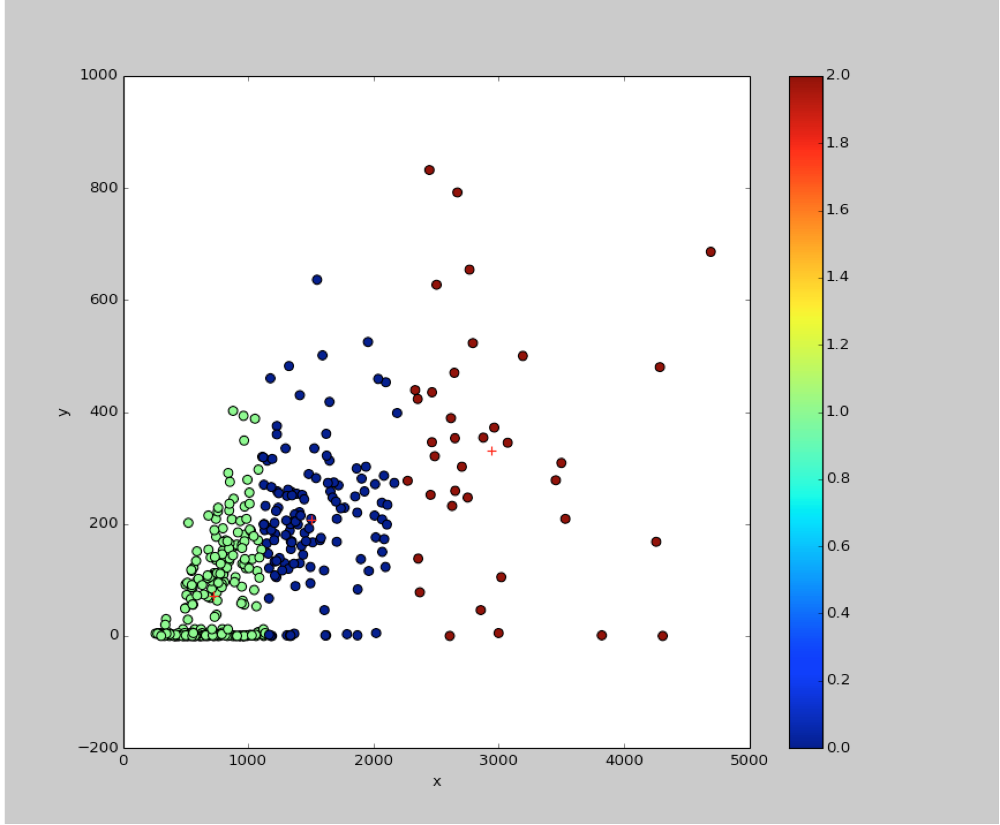
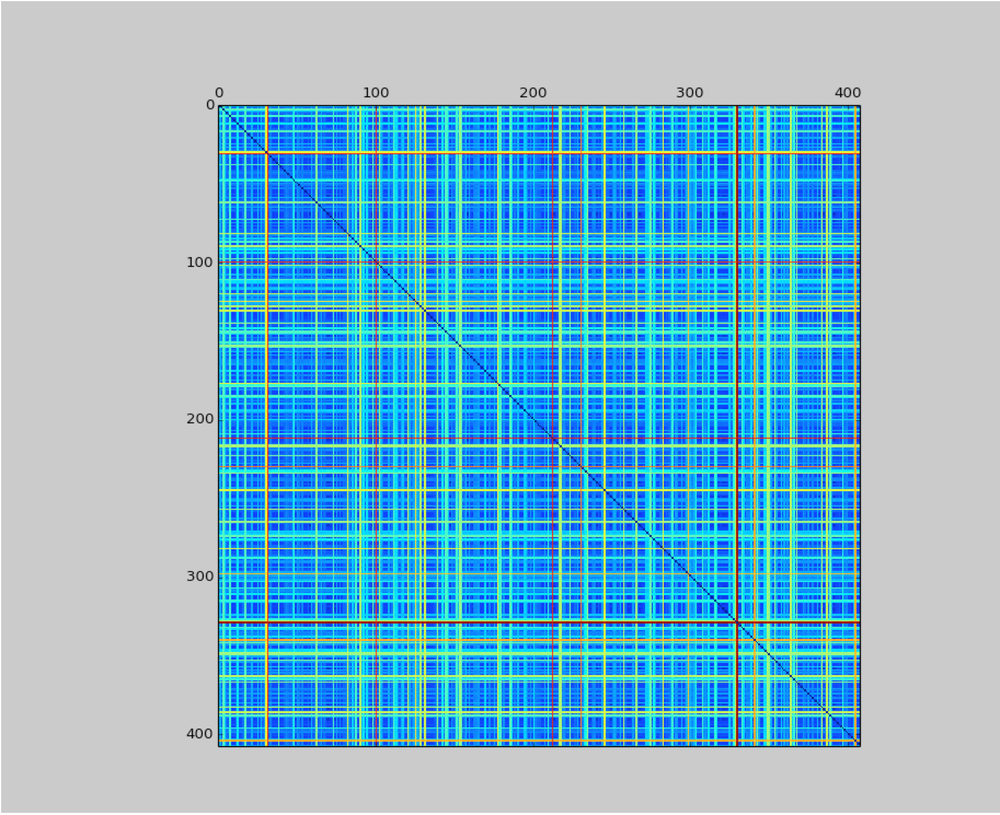

# Blurb-Analysis Project
CS401 Project - Maynooth University

## Goals
The goal of this project was to find a distance metric between the different documents of the
and try to find cluster with these metrics. 

## Installation
In order to run the code, it is necessary you can use:
```
make install
make run
```

## Libraries
We used sklearn for learning phase.
Python Stem library and TextBlob for preprocessing text data.

## First try
The first idea to assess the quality of a document was to use the size
of the document and the size of its comment section. We can suppose that 
the longest comments sections are the ones representing good documents.

We then apply a KMeans algorithm with 3 centers. 



## Second try

We then used a simple Hamming Distance between the different documents. This metrics was not really useful, because it does not represent well the differences between two documents. Indeed, most of the documents are 
completely differents in regards of the Hamming Distance. 



## Third try

We then implement a version of tf-idf which allows us to compare the 
documents based on certain word.

## Fourth try

We try an other k-means algorithm on a different set of features: the 
length of each part of the document.